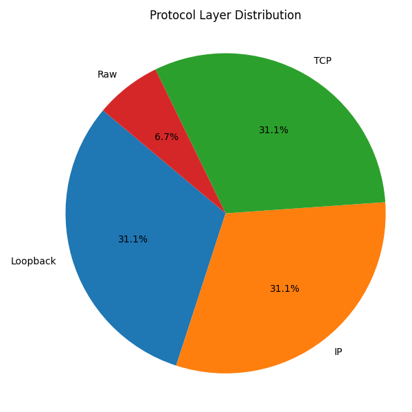
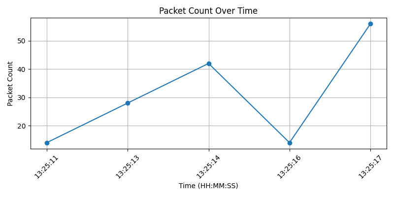
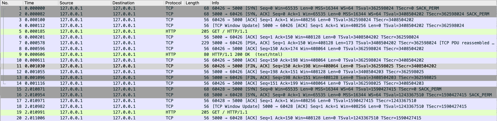

# 5G Packet Analyzer

A lightweight Python-based tool to simulate, capture, and analyze 5G-style network traffic using Flask, Scapy, and tshark.

📌 **Current Version:** `v1.0` ・ 🛠️ Grace Chen ・ 🌐 [GitHub](https://github.com/chenyurongrace/5g-packet-analyzer)

## ✨ Features

- Simulate HTTP traffic locally with Flask

- Capture packets using `tshark` into `.pcap` format

- Analyze protocol layers and visualize trends with Scapy & Matplotlib

- Extract HTTP request/response content directly from captured packets

## 📁 Project Structure

```
5g-packet-analyzer/
├── flask_server.py               # Local HTTP server to simulate 5G traffic
├── analyze_packets.py            # Analyzer: protocol layers, trends, HTTP content
├── send_requests.py              # Request simulator using Python requests

├── data/                         # Folder for captured network data
│   └── 5g_packets.pcap           # Traffic captured with tshark

├── assets/                       # Output visualizations and screenshots
│   ├── protocol_pie.png          # Protocol layer distribution pie chart
│   ├── packet_trend.png          # Line chart showing packets per second
│   └── wireshark_screenshot.png  # Optional Wireshark view of packets

├── requirements.txt              # Python dependencies
├── .gitignore                    # Files to exclude from version control
├── LICENSE                       # Open-source license (MIT)
└── README.md                     # Project description and usage guide
```

## 🧪 Example Outputs

### Protocol Layer Distribution

<p align="center">
  
</p>

### Packet Count Over Time

<p align="center">
  
</p>

### Wireshark Screenshot

<p align="center">
  
</p>

---

## 🚀 Quickstart

### 1. Install dependencies

```bash
pip install -r requirements.txt
```

### 2. Start Flask server

```bash
python flask_server.py
```

Leave this running in one terminal window (Terminal A).

### 3. Open another terminal (Terminal B) and start packet capture

```bash
sudo tshark -i lo0 -a duration:10 -w data/5g_packets.pcap
```

⏳ Important: You must run step 4 (send requests) within the 10-second capture window, or packets won't be recorded.

### 4. In a third terminal (Terminal C), run traffic simulator

```bash
python send_requests.py
```

This will send 10–20 HTTP GET requests to localhost:5000.

### 5. After tshark finishes (10 seconds), analyze results

```bash
python analyze_packets.py
```

This generates:

✅ Console summary of protocol layers and HTTP payloads

📈 Saved charts under assets/

## ✅ Notes

Capture interface is set to lo0 for localhost traffic.

You can view the .pcap in Wireshark directly for further inspection.

If port 5000 is in use, you may need to kill the process or change the port in flask_server.py.

## 📜 License

MIT License
© 2025 Grace Chen
